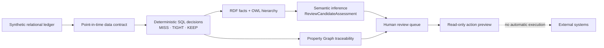

# Maritime Actionable Ontology | Data, Graph & AI Decision-Support Demo

[한국어](README.md) | **English**

## Portfolio summary

Designed and validated a fully synthetic maritime ship-to-shore decision-support PoC that turns a delayed-ETA scenario into traceable, human-reviewed review candidates. The solution combines point-in-time data contracts that prevent future-data leakage, deterministic SQL decision logic, RDF/OWL inference for reusable business meaning, and Property Graph traversal for end-to-end impact traceability across incidents, port calls, voyages, vessels, containers, and bookings.

It also includes reproducible quality and lineage checks, fail-closed validation, and preview-only action outputs with external execution explicitly disabled. AI is represented only as a controlled handoff for human-reviewed advisories. Built entirely with synthetic fixtures; no customer or production data, credentials, or operational integrations are included.

> This repository contains synthetic fixtures only. It does not contain production data, does not change bookings or schedules, and does not execute external operational actions.

## Business problem

A delayed vessel ETA can affect much more than one schedule. Reviewers may need to connect the arrival event to a port call, container readiness, an outbound load cutoff, the onward voyage, and customer bookings. In a relational environment, that investigation requires multiple joins and explicit time boundaries, while the shared business meaning of decision codes can easily be duplicated across downstream systems.

This project separates those concerns:

- **SQL** selects only information available at the declared review time and deterministically evaluates each connection as `MISS`, `TIGHT`, or `KEEP`.
- **RDF/OWL** does not recalculate time; it adds the reusable business meaning that `MISS` and `TIGHT` are both review candidates.
- **Property Graph** traces the impact path across connected operational entities.
- **Action preview** exposes a read-only queue for human review and never triggers an external action.

## What I designed and validated

- Translated an ambiguous delayed-ETA use case into a versioned point-in-time data contract and deterministic decision policy.
- Separated event occurrence time from receipt time to prevent future-data leakage.
- Built deterministic synthetic fixtures with explicit expected outcomes and reconciliation checks.
- Defined clear responsibilities across relational calculation, RDF/OWL semantics, and Property Graph traceability.
- Carried fixture, contract, policy, ontology, and as-of-time provenance through the outputs.
- Added fail-closed prerequisites and validation gates instead of silently accepting unverified results.
- Kept AI output advisory-only, human-reviewed, and behind a preview-only boundary.

## Architecture

The SQL layer owns timestamp arithmetic and decision boundaries. RDF/OWL adds reusable business meaning: `MissAssessment` and `TightAssessment` are subclasses of `ReviewCandidateAssessment`; `KeepAssessment` is not. The Property Graph answers path and impact questions across connected operational entities. Any action candidate remains an advisory for human review.

## Validated synthetic outcome

The bundled fixture evaluates 36 container connections at its declared as-of time:

| Deterministic decision | Expected count |
|---|---:|
| `MISS` | 9 |
| `TIGHT` | 6 |
| `KEEP` | 21 |
| Semantic review candidates (`MISS + TIGHT`) | 15 |

These counts are test assertions for a synthetic fixture, not operational recommendations. A `MISS` result is not proof that a transshipment failure occurred, and a review candidate is not authorization to act.

## Repository map

| Path | Purpose |
|---|---|
| [`sql/`](sql/) | Schema, synthetic fixture, deterministic decision, semantic, Property Graph, and read-only preview scripts |
| [`ontology/`](ontology/) | OWL vocabulary for the semantic layer |
| [`graph-studio/`](graph-studio/) | Reproducible Graph Studio RDF assets and SPARQL checks |
| [`tests/expected/`](tests/expected/) | Expected fixture and validation counts |
| [`docs/`](docs/) | Korean architecture, contract, walkthrough, and scope documentation |

## Reproduce the demo

Run the SQL files in numerical order while connected directly to a dedicated `MARITIME_DEMO` demo schema. The scripts deliberately stop when that schema or their expected prerequisites are not present.

1. Run [`sql/00-setup/00_preflight.sql`](sql/00-setup/00_preflight.sql).
2. Run [`sql/01-data/`](sql/01-data/) to create and validate the synthetic relational fixture.
3. Run [`sql/02-decision/`](sql/02-decision/) to create the point-in-time contract and deterministic decisions.
4. Run [`sql/02-semantics/`](sql/02-semantics/) to create the RDF network, load the ontology, project facts, and validate inference.
5. Run [`sql/03-property-graph/`](sql/03-property-graph/) to build and validate the Property Graph.
6. Run [`sql/04-action/`](sql/04-action/) to expose read-only action-preview views.
7. Optionally rebuild the importable Graph Studio assets with `npm run build:graph-studio-assets`.

## Safety boundary

- All identities, ports, vessels, voyages, bookings, containers, timestamps, and decisions are synthetic.
- The project provides decision support only; human reviewers remain responsible for any operational choice.
- `PREVIEW_ONLY` and `EXTERNAL_EXECUTION_YN = 'N'` are carried into the contract and action-preview layer.
- The public kit includes no model profile, credential, or external AI call.
- No script sends a message, changes a booking, instructs a terminal, or calls an external system.
