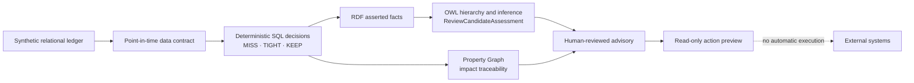
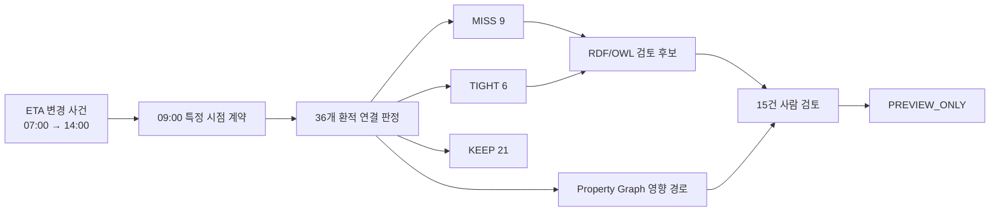

# Maritime Actionable Ontology | Data, Graph & AI Decision-Support Demo

[Full English documentation](README.en.md)

**A fully synthetic maritime ship-to-shore decision-support reference implementation designed for Oracle Database and Graph Studio, connecting point-in-time data contracts, deterministic decisions, RDF/OWL semantic inference, Property Graph traceability, and human-reviewed action previews.**

> **Synthetic-data notice:** Every vessel, voyage, port call, booking, container, timestamp, and decision in this repository is fictional and deterministically generated. No customer or production data, proprietary operating rules, credentials, or environment-specific connection details are included.

## Business Problem

A delayed vessel ETA can affect far more than one arrival schedule. Reviewers may need to connect the delay event to a port call, container readiness, an outbound loading cutoff, the next voyage, and customer bookings. In a relational environment, that investigation requires multiple joins and explicit time boundaries, while the shared business meaning of decision codes can easily be duplicated across reports and applications.

This demo separates those responsibilities. SQL selects only facts available at the declared review time and deterministically evaluates each connection as `MISS`, `TIGHT`, or `KEEP`. RDF/OWL adds the reusable meaning that `MISS` and `TIGHT` are both review candidates without recalculating time. A Property Graph then traces the impact path across connected maritime entities. The final output remains a read-only advisory for human review.

## At a Glance

| Area | Implemented scope |
|---|---|
| Technology | Oracle SQL/PLSQL, RDF/OWL2RL, SPARQL, SQL Property Graph, Graph Studio, Node.js validation |
| Scenario | One synthetic ETA revision from 07:00 to 14:00; 420-minute delay evaluated at 09:00 KST |
| Relational model | 11 maritime business tables + 3 demo contract/control tables |
| Point-in-time control | Future revision received after the review timestamp is excluded |
| Deterministic decisions | 36 connections: `MISS` 9, `TIGHT` 6, `KEEP` 21 |
| RDF/OWL semantics | 134 TBox triples, 664 ABox triples, 15 inferred review candidates |
| Property Graph | 71 vertices, 158 edges, and 36 incident-to-booking paths |
| Quality and lineage | Fixture, contract, policy, ontology, and as-of versions; 0 future-event, mismatch, or negative-control leaks |
| Safety boundary | `PREVIEW_ONLY`, human review required, 0 automatic actions, 0 external executions |
| AI scope | Controlled advisory handoff only; no public AI profile, credential, or external model call |

## Architecture



## My Role and Contributions

I translated an ambiguous delayed-ETA business question into a bounded, reproducible Data, Graph, and AI decision-support demonstration.

- Framed the ship-to-shore review journey and mapped each business question to relational calculation, semantic inference, or graph traversal.
- Designed the synthetic maritime data model, stable IDs, versioned fixtures, explicit grains, and point-in-time data contract.
- Implemented deterministic SQL logic that separates event occurrence time from receipt time and prevents future-data leakage.
- Defined the RDF/OWL business hierarchy that groups `MissAssessment` and `TightAssessment` under `ReviewCandidateAssessment`.
- Built the Property Graph projections for tracing delay impact across incidents, port calls, voyages, vessels, containers, and bookings.
- Added expected-count reconciliation, lineage fields, negative controls, and fail-closed prerequisites.
- Kept every downstream output human-reviewed and preview-only, with external execution explicitly disabled.
- Generalized the project into a public synthetic kit with customer-specific names, data, credentials, logs, and environment details removed.

## Validation Status

“Implemented,” “repository-validated,” and “externally executed” are deliberately kept separate.

| Capability | Status |
|---|---|
| Public-scope and reserved-marker checks | **Repository-validated** with `npm test` |
| Synthetic decision contract: 36 / 9 / 6 / 21 / 15 | **Repository-validated** against versioned expected results |
| OWL subclass assertions and Graph Studio asset checksums | **Repository-validated** |
| Point-in-time SQL pipeline | **Implemented**; requires execution in a dedicated Oracle demo schema |
| RDF network, rulebase, and SPARQL runtime | **Reproducible assets included**; requires Oracle RDF runtime execution |
| SQL Property Graph creation and path validation | **Implemented**; requires Oracle Database and Graph Studio execution |
| Read-only action preview | **Implemented** with external execution disabled by contract |
| External AI advisory or operational integration | **Not included**; controlled handoff boundary only |

## Scope and Safety Boundaries

- This is a technical decision-support demonstration, not a production deployment or customer implementation.
- A `MISS` is a deterministic synthetic-fixture result, not proof that a real transshipment failure occurred.
- A `ReviewCandidateAssessment` identifies a human review candidate; it is not an approval or operational command.
- SQL owns time arithmetic and decision boundaries. RDF/OWL adds shared meaning but does not replace or mutate the SQL decision.
- Property Graph traversal explains connected impact paths but does not calculate decisions or execute actions.
- The action layer is read-only and carries `PREVIEW_ONLY` and `EXTERNAL_EXECUTION_YN = 'N'`.
- No script sends a message, changes a booking, instructs a terminal, or calls an external operational system.

---

# 상세 가이드 (한국어): 해상 운송 Actionable Ontology 데모

이번 프로젝트는 선박 입항 지연이 환적 연결과 고객 예약에 미치는 영향을 추적하는 **완전 합성 선박–해안 의사결정 지원 데모**입니다. 관계형 원장, 특정 시점 기준 데이터 계약, 결정론적 SQL 판정, RDF/OWL 의미 추론, Property Graph 경로 분석을 하나의 검증 가능한 흐름으로 연결합니다.

> 이 저장소에는 합성 테스트 데이터만 포함되어 있습니다. 고객 또는 운영 데이터가 아니며, 예약·운항 일정을 변경하거나 외부 시스템의 운영 조치를 실행하지 않습니다.

## 데모 스토리

1. **관계형 업무 원장** — 선박, 항차, 기항, ETA 변경 이력, 예약, 컨테이너, 환적 연결 계획을 합성 테이블로 구성합니다.
2. **특정 시점 기준 판정** — 오전 9시까지 수신된 ETA revision만 선택하고 연결별 여유시간을 계산해 `MISS`, `TIGHT`, `KEEP`으로 판정합니다.
3. **RDF/OWL 의미 추론** — 서로 다른 판정인 `MISS`와 `TIGHT`를 모두 사람이 추가 확인해야 하는 `ReviewCandidateAssessment`로 추론합니다.
4. **Property Graph 영향 경로** — 지연 사건에서 기항·항차·선박·컨테이너·예약·다음 항차로 이어지는 경로를 탐색합니다.
5. **사람 검토용 미리보기** — 검토 후보와 근거를 읽기 전용으로 제공하며 자동 조치와 외부 실행은 허용하지 않습니다.



## 저장소 구성

| 경로 | 용도 |
|---|---|
| [`sql/`](sql/) | 스키마, 합성 데이터, 특정 시점 판정, RDF, Property Graph, 읽기 전용 미리보기 SQL |
| [`ontology/`](ontology/) | 업무 유형과 상하위 의미를 정의한 OWL 온톨로지 |
| [`graph-studio/`](graph-studio/) | Graph Studio 가져오기용 TBox/ABox와 SPARQL 검증 질의 |
| [`tests/expected/`](tests/expected/) | 합성 시나리오의 버전, 기대 건수, 검증 기준 |
| [`docs/`](docs/) | 아키텍처, 데이터 계약, 데모 진행, 공개 및 보안 범위 문서 |
| [`scripts/`](scripts/) | 공개 범위, 수치, 온톨로지, 자산 무결성 검증 |

## 현재 상태와 기대 결과

공개 저장소는 일반화된 합성 객체와 재현 가능한 스크립트로 구성했습니다. 저장소 검증은 판정 수치, 핵심 OWL 선언, Graph Studio 자산 checksum, 고객 원본 표식의 부재를 확인합니다. Oracle Database에서의 SQL/RDF/Property Graph 실행은 전용 데모 스키마와 해당 런타임이 필요하며, 외부 AI 호출은 이 공개 키트에 포함하지 않습니다.

선언된 기준 시점은 `2026-08-12 09:00 +09:00`입니다. ETA는 07시에서 14시로 420분 변경됐으며, 08시 57분까지 수신된 revision 2는 사용하고 09시 07분에 수신된 미래 revision은 제외합니다.

| 검증 항목 | 기대 결과 |
|---|---:|
| 평가 대상 환적 연결 | 36 |
| 연결된 컨테이너 | 36 |
| 연결된 예약 | 18 |
| `MISS` | 9 |
| `TIGHT` | 6 |
| `KEEP` | 21 |
| 의미 기반 추가 검토 후보 | 15 |
| 자동 조치 / 외부 실행 | 0 / 0 |

이 수치는 합성 fixture의 테스트 기대값이지 운영 권고가 아닙니다. `MISS` 9건은 실제 환적 실패가 발생했다는 뜻이 아니며, 검토 후보 15건도 승인 또는 조치 건수가 아닙니다.

## 실행 순서

전용 `MARITIME_DEMO` 데모 스키마에 직접 접속한 뒤 SQL 파일을 번호 순서대로 실행합니다. 필수 스키마나 선행 조건이 맞지 않으면 스크립트는 확인되지 않은 결과로 계속 진행하지 않고 중단됩니다.

1. [`sql/00-setup/00_preflight.sql`](sql/00-setup/00_preflight.sql)에서 실행 사용자와 필수 전제조건을 확인합니다.
2. [`sql/01-data/`](sql/01-data/)에서 합성 관계형 원장과 기준 시나리오를 생성합니다.
3. [`sql/02-decision/`](sql/02-decision/)에서 특정 시점 기준 계약과 결정론적 판정을 생성합니다.
4. [`sql/02-semantics/`](sql/02-semantics/)에서 RDF network, ontology, 사실 트리플, 추론 결과를 구성합니다.
5. [`sql/03-property-graph/`](sql/03-property-graph/)에서 Property Graph와 경로 검증 객체를 생성합니다.
6. [`sql/04-action/`](sql/04-action/)에서 읽기 전용 조치 미리보기를 생성합니다.

Graph Studio 자산을 다시 생성하고 공개 저장소 검증을 실행하려면 다음 명령을 사용합니다.

```bash
npm run build:graph-studio-assets
npm test
```

## 핵심 설계 원칙

- **시점 일관성:** `SOURCE_EVENT_AT`과 `RECEIVED_AT`을 분리하고 `RECEIVED_AT <= DATA_AS_OF_TS`인 사실만 사용합니다.
- **결정론적 계산:** 시간 계산과 `MISS`·`TIGHT`·`KEEP` 판정은 exact timestamp를 사용하는 SQL 정책이 담당합니다.
- **의미와 계산의 분리:** RDF/OWL은 시간을 다시 계산하지 않고 상세 판정에 재사용 가능한 상위 업무 의미를 부여합니다.
- **경로와 판정의 분리:** Property Graph는 영향 경로를 탐색하지만 판정이나 조치를 생성하지 않습니다.
- **추적 가능성:** fixture, contract, policy, ontology, 기준 시점 버전을 결과와 함께 유지합니다.
- **안전한 중단:** 전제조건이나 검증 결과가 맞지 않으면 `fail-closed` 방식으로 중단합니다.
- **사람 중심 의사결정:** 모든 후속 결과는 `human-reviewed`, `preview-only`이며 자동 실행으로 이어지지 않습니다.

## 상세 문서

- [아키텍처와 계층별 역할](docs/architecture.md)
- [특정 시점 기준 데이터 계약](docs/data-contract.md)
- [데모 진행 가이드](docs/demo-walkthrough.md)
- [보안 및 공개 범위](docs/security-and-scope.md)
- [SQL 실행 순서](sql/README.md)
- [전체 영문 포트폴리오 설명](README.en.md)

## 주의 사항

이 프로젝트는 제품 기능과 설계 접근법을 설명하기 위한 합성 데이터 데모입니다. 결과를 실제 운항, 환적 실패 판정, 예약 변경, 고객 통지 또는 외부 시스템 실행의 근거로 사용할 수 없습니다. 실제 업무 적용에는 별도의 데이터 검증, 정책 승인, 보안 통제, 책임자 검토가 필요합니다.
