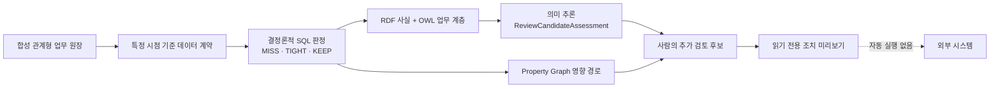

# Maritime Actionable Ontology | 데이터·그래프·AI 의사결정 지원 데모

**한국어** | [English portfolio overview](README.en.md)

선박 입항 지연이 환적 연결과 고객 예약에 미치는 영향을 추적하는 **완전 합성(synthetic) 선박–해안 의사결정 지원 레퍼런스 구현**입니다. 관계형 원장, 특정 시점 기준 데이터 계약, 결정론적 SQL 판정, RDF/OWL 의미 추론, Property Graph 경로 분석을 하나의 검증 가능한 흐름으로 연결합니다.

> 이 저장소에는 합성 테스트 데이터만 포함되어 있습니다. 고객 또는 운영 데이터가 아니며, 예약·운항 일정을 변경하거나 외부 시스템의 운영 조치를 실행하지 않습니다.

## 프로젝트가 해결하는 문제

선박의 ETA가 늦어지면 영향은 한 개의 일정에서 끝나지 않습니다. 입항 기항, 컨테이너 하역 준비시간, 다음 항차의 적재 마감, 고객 예약을 함께 확인해야 합니다. 관계형 테이블만 사용할 경우 이러한 영향을 파악하려면 여러 테이블과 시간 조건을 조합해야 하고, 판정 코드의 공통 업무 의미도 각 시스템에서 따로 관리하기 쉽습니다.

이 프로젝트는 다음과 같이 문제를 나눠 해결합니다.

- **SQL**은 점검 시점에 실제로 알 수 있었던 정보만 선택하고 `MISS`, `TIGHT`, `KEEP`을 계산합니다.
- **RDF/OWL**은 시간을 다시 계산하지 않고 `MISS`와 `TIGHT`에 ‘추가 검토 후보’라는 재사용 가능한 업무 의미를 부여합니다.
- **Property Graph**는 지연 사건에서 기항·항차·선박·컨테이너·예약으로 이어지는 영향 경로를 탐색합니다.
- **조치 미리보기**는 사람이 검토할 후보만 읽기 전용으로 제공하며 외부 실행은 차단합니다.

## 핵심 구현 내용

- 운영 점검 이후 수신된 미래 정보를 제외하는 **특정 시점 기준(point-in-time) 데이터 계약**
- 컨테이너 환적 연결을 `MISS`, `TIGHT`, `KEEP`으로 분류하는 **결정론적 SQL 판정 로직**
- `MISS`와 `TIGHT`를 공통 `ReviewCandidateAssessment`로 추론하는 **RDF/OWL 의미 계층**
- 사건부터 예약과 다음 항차까지 연결하는 **Property Graph 추적 구조**
- 합성 데이터 건수, 의미 일관성, 그래프 구조, 안전 경계를 확인하는 **재현 가능한 검증 게이트**
- `PREVIEW_ONLY`, 사람 검토, 외부 실행 금지를 명시한 **읽기 전용 조치 미리보기**
- AI 권고를 위한 통제된 연결 지점. 공개 저장소에는 AI 프로필, 자격증명, 외부 모델 호출이 포함되지 않습니다.

## 아키텍처



SQL 계층은 시간 계산과 판정 경계를 책임집니다. RDF/OWL은 `MissAssessment`와 `TightAssessment`가 `ReviewCandidateAssessment`의 하위 유형이라는 공통 업무 의미를 추가합니다. Property Graph는 연결된 업무 객체 사이의 경로와 영향 범위를 보여줍니다. 어떤 후보도 자동 조치로 이어지지 않으며 최종 판단은 사람에게 남습니다.

## 설계 및 검증 범위

- 지연 ETA라는 업무 문제를 데이터 계약과 버전이 있는 판정 규칙으로 구체화
- 미래 정보가 섞이지 않도록 이벤트 발생 시각과 수신 시각을 분리
- 합성 업무 데이터와 기대 결과가 항상 동일하게 재현되도록 fixture 구성
- SQL 판정, RDF/OWL 추론, Property Graph 추적의 역할을 분리
- 데이터 계보와 버전 정보를 판정 및 의미 사실에 함께 전달
- 전제조건이나 검증 결과가 맞지 않으면 결과를 사용하지 않는 `fail-closed` 방식 적용
- AI 결과는 선택적 권고로만 연결하고 사람 검토 및 `preview-only` 경계 유지

## 저장소 구성

| 경로 | 내용 |
|---|---|
| [`sql/`](sql/) | 스키마, 합성 데이터, 판정, RDF, Property Graph, 읽기 전용 미리보기 SQL |
| [`ontology/`](ontology/) | 의미 계층과 업무 용어를 정의한 OWL 온톨로지 |
| [`graph-studio/`](graph-studio/) | 재현 가능한 Graph Studio RDF 자산과 SPARQL 검증 질의 |
| [`tests/expected/`](tests/expected/) | 합성 시나리오의 기대 건수와 검증 기준 |
| [`docs/`](docs/) | 아키텍처, 데이터 계약, 시연 흐름, 공개 범위 문서 |

## 빠른 실행

전용 `MARITIME_DEMO` 데모 스키마에 직접 접속한 뒤 SQL 파일을 번호 순서대로 실행합니다. 필수 스키마나 선행 조건이 맞지 않으면 스크립트는 계속 진행하지 않고 중단됩니다.

1. [`sql/00-setup/00_preflight.sql`](sql/00-setup/00_preflight.sql)을 실행합니다.
2. [`sql/01-data/`](sql/01-data/)에서 합성 관계형 데이터를 생성하고 검증합니다.
3. [`sql/02-decision/`](sql/02-decision/)에서 특정 시점 기준 계약과 결정론적 판정을 생성합니다.
4. [`sql/02-semantics/`](sql/02-semantics/)에서 RDF 네트워크와 온톨로지를 구성하고 추론을 검증합니다.
5. [`sql/03-property-graph/`](sql/03-property-graph/)에서 Property Graph를 생성하고 경로 구조를 검증합니다.
6. [`sql/04-action/`](sql/04-action/)에서 읽기 전용 조치 미리보기를 생성합니다.
7. 필요하면 Graph Studio 가져오기 자산을 다시 생성합니다.

   ```bash
   npm run build:graph-studio-assets
   ```

발표 흐름은 [`docs/demo-walkthrough.md`](docs/demo-walkthrough.md), 공개 및 안전 경계는 [`docs/security-and-scope.md`](docs/security-and-scope.md)에서 확인할 수 있습니다.

## 합성 시나리오의 기대 결과

선언된 점검 시점을 기준으로 합성 컨테이너 환적 연결 36건을 평가합니다.

| 결정론적 판정 | 기대 건수 |
|---|---:|
| `MISS` | 9 |
| `TIGHT` | 6 |
| `KEEP` | 21 |
| 의미 기반 추가 검토 후보 (`MISS + TIGHT`) | 15 |

이 숫자는 합성 fixture의 검증 기대값이며 운영 권고가 아닙니다. `MISS`는 실제 환적 실패가 발생했다는 증거가 아니고, 추가 검토 후보 15건 역시 조치 승인 건수가 아닙니다.

## 안전 및 공개 범위

- 모든 선박, 항차, 항구, 기항, 예약, 컨테이너, 시각, 판정은 합성 데이터입니다.
- 이 프로젝트는 의사결정 지원용이며 운영 선택의 책임은 사람에게 있습니다.
- `PREVIEW_ONLY`와 `EXTERNAL_EXECUTION_YN = 'N'`을 데이터 계약과 조치 미리보기 계층에 전달합니다.
- 자격증명, Wallet, 개인 키, 로컬 환경 파일, 실행 로그, 운영 데이터 추출본을 저장소에 추가하지 않습니다.

자세한 내용은 [`docs/security-and-scope.md`](docs/security-and-scope.md)를 참고하세요.
