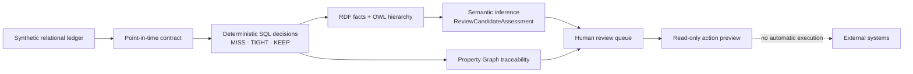

# Maritime Actionable Ontology | Data, Graph & AI Decision Demo

A fully synthetic maritime ship-to-shore decision-support reference implementation. It follows one delayed-arrival scenario from relational facts to deterministic connection assessment, RDF/OWL semantic inference, and Property Graph traceability.

> This repository contains synthetic fixtures only. It does not contain production data, does not change bookings or schedules, and does not execute external operational actions.

## What it demonstrates

- A point-in-time data contract that excludes information received after the operating cut-off.
- Deterministic SQL classification of container connections as `MISS`, `TIGHT`, or `KEEP`.
- RDF/OWL semantics that infer a shared `ReviewCandidateAssessment` type for `MISS` and `TIGHT` without recalculating time values.
- A Property Graph that traces an incident through port calls, vessels, voyages, containers, and bookings.
- Read-only, human-reviewed action previews with explicit `PREVIEW_ONLY` and no-external-execution controls.
- A controlled handoff point for human-reviewed AI advisories; this public kit intentionally includes no model profile, credential, or external AI call.
- Validation gates for fixture counts, semantic consistency, graph shape, and safety boundaries.

## Architecture



The SQL layer owns timestamp arithmetic and decision boundaries. RDF/OWL adds reusable business meaning: `MissAssessment` and `TightAssessment` are subclasses of `ReviewCandidateAssessment`; `KeepAssessment` is not. The Property Graph answers path and impact questions across the connected operational entities. Any action candidate remains an advisory for human review.

## Repository layout

| Path | Purpose |
|---|---|
| [`sql/`](sql/) | Schema, synthetic fixture, deterministic decision, semantic, Property Graph, and read-only preview scripts. |
| [`ontology/`](ontology/) | OWL vocabulary for the semantic layer. |
| [`graph-studio/`](graph-studio/) | Reproducible Graph Studio RDF assets and SPARQL checks. |
| [`tests/expected/`](tests/expected/) | Expected fixture and validation counts. |
| [`docs/`](docs/) | Architecture, contract, walkthrough, and scope documentation. |

## Quick start

Run the SQL files in numerical order while connected directly to the dedicated `MARITIME_DEMO` demo schema. The scripts deliberately stop when that schema or their expected prerequisites are not present.

1. Run [`sql/00-setup/00_preflight.sql`](sql/00-setup/00_preflight.sql).
2. Run the files in [`sql/01-data/`](sql/01-data/) to create and validate the synthetic relational fixture.
3. Run [`sql/02-decision/`](sql/02-decision/) to create the point-in-time contract and deterministic decisions.
4. Run [`sql/02-semantics/`](sql/02-semantics/) to create the RDF network, load the ontology, project facts, and validate inference.
5. Run [`sql/03-property-graph/`](sql/03-property-graph/) to build and validate the Property Graph.
6. Run [`sql/04-action/`](sql/04-action/) to expose read-only action-preview views.
7. Optionally rebuild the importable Graph Studio assets:

   ```bash
   npm run build:graph-studio-assets
   ```

Use [`docs/demo-walkthrough.md`](docs/demo-walkthrough.md) for the presentation flow and [`docs/security-and-scope.md`](docs/security-and-scope.md) for the safety boundary.

## Expected synthetic outcome

The bundled fixture evaluates 36 container connections at its declared as-of time:

| Deterministic decision | Expected count |
|---|---:|
| `MISS` | 9 |
| `TIGHT` | 6 |
| `KEEP` | 21 |
| Semantic review candidates (`MISS + TIGHT`) | 15 |

These counts are demonstration assertions, not operational recommendations. A `MISS` result is not proof that a transshipment failure occurred, and a review candidate is not an authorization to act.

## Safety and scope

- All identities, ports, vessels, voyages, bookings, containers, timestamps, and decisions are synthetic.
- The project provides decision support only. Human reviewers remain responsible for any operational choice.
- `PREVIEW_ONLY` and `EXTERNAL_EXECUTION_YN = 'N'` are carried into the contract and action-preview layer.
- Do not add credentials, wallets, private keys, local environment files, execution logs, or production extracts to this repository.

See [`docs/security-and-scope.md`](docs/security-and-scope.md) for details.
