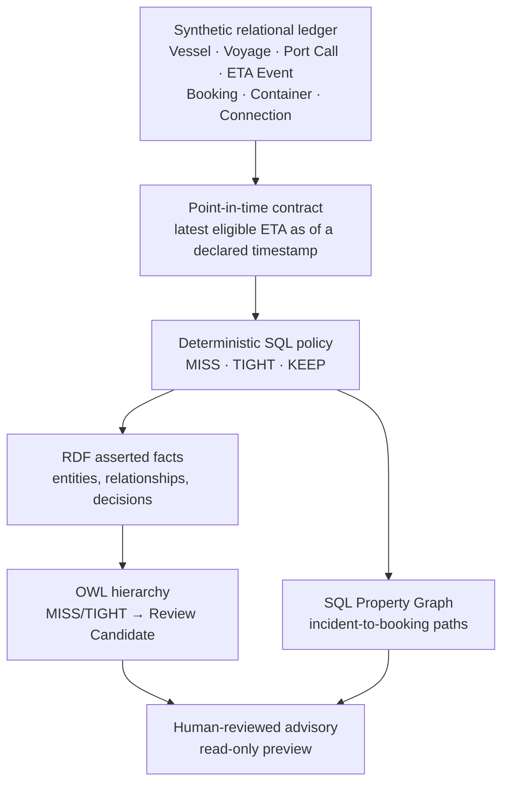

# 아키텍처

## 목적

이 참조 아키텍처는 합성 입항 지연 시나리오를 추적하고 검토할 수 있는 의사결정 지원 흐름으로 구성합니다. 계산, 업무 의미, 영향 경로 탐색을 서로 분리해 각 계층의 결과를 독립적으로 확인할 수 있도록 설계했습니다.



## 계층별 역할

| 계층 | 담당하는 역할 | 담당하지 않는 역할 |
|---|---|---|
| 관계형 원장 | 합성 기준 정보, ETA 변경 이력, 예약 및 환적 연결 사실 | 여러 시스템에 흩어진 사실의 업무적 해석 |
| 특정 시점 기준 데이터 계약 | `DATA_AS_OF_TS` 시점에 사용할 수 있었던 ETA 이벤트 선택 | 미래 정보 또는 기준 시점 이후 도착한 이벤트 사용 |
| SQL 판정 로직 | 시간 계산과 `MISS` / `TIGHT` / `KEEP` 판정 | OWL 하위 유형 추론 |
| RDF/OWL | 재사용 가능한 업무 유형과 관계, 공통 검토 의미 | ETA 시간 재계산 또는 운영 명령 수행 |
| Property Graph | 사건에서 영향 대상까지의 경로 탐색과 시각화 | 판정 계산 또는 조치 실행 |
| 미리보기 계층 | 사람이 검토할 후보 제공 | 예약 변경, 메시지 전송 또는 외부 명령 실행 |

## 한 문장으로 설명하는 의미 추론

SQL 계층은 각 대상을 구체적인 판정 유형으로 기록합니다. OWL은 `MissAssessment`와 `TightAssessment`가 공통 검토 유형의 하위 클래스라는 정의를 이용해, 해당 대상을 `ReviewCandidateAssessment`로도 추론합니다.

따라서 이후 온톨로지에 검토가 필요한 새로운 판정 유형이 추가되더라도 다음 질의를 그대로 재사용할 수 있습니다.

```sparql
PREFIX mao: <https://example.org/maritime-actionable-ontology/ontology/>

SELECT ?assessment
WHERE {
  ?assessment a mao:ReviewCandidateAssessment .
}
```

이 추론은 새로운 일정 판정을 만들지 않습니다. 시간 계산과 판정은 버전으로 관리되는 SQL 정책에서 계속 담당합니다.

## 그래프 기반 추적

Property Graph는 다음 일곱 가지 정점 유형으로 구성됩니다.

- 지연 사건
- 선박
- 항차
- 항구
- 기항
- 예약
- 컨테이너

이 정점들은 사건-기항, 항차-선박, 항차-기항, 예약-컨테이너, 컨테이너-입항 및 다음 항차 경로 등을 포함한 여덟 가지 관계 유형으로 연결됩니다. 이를 통해 “이 지연 기항과 연결된 예약과 다음 항차는 무엇인가?”와 같은 질문의 경로를 탐색할 수 있습니다.

## 통제 경계

모든 구성요소는 의사결정 지원을 목적으로 설계했습니다.

- 검증 스크립트는 필수 전제조건과 합성 데이터의 예상 건수를 확인합니다.
- 전제조건이 충족되지 않으면 확인되지 않은 결과로 계속 진행하지 않고 실행을 중단합니다.
- 조치 계층은 읽기 전용 미리보기만 제공합니다.
- 어떤 스크립트도 메시지를 전송하거나, 예약을 변경하거나, 터미널에 지시하거나, 외부 시스템을 호출하지 않습니다.
