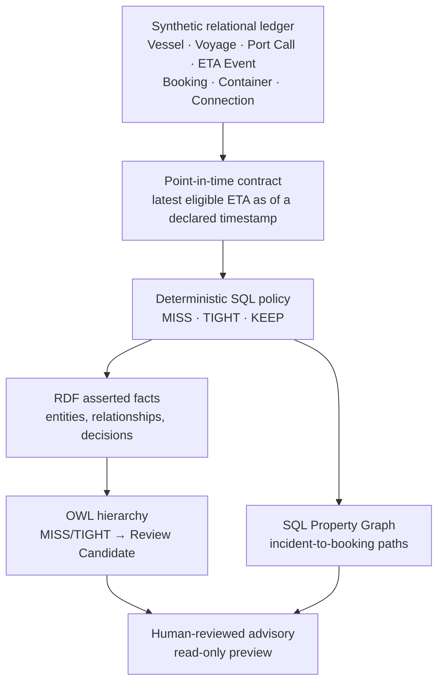

# Architecture

## Purpose

This reference architecture turns a synthetic late-arrival scenario into a traceable, reviewable decision-support workflow. It separates calculation, semantic meaning, and impact exploration so that each layer can be inspected independently.



## Layer responsibilities

| Layer | Owns | Does not own |
|---|---|---|
| Relational ledger | Synthetic master data, ETA revisions, booking and connection facts | Business interpretation across systems |
| Point-in-time contract | The eligible event set at `DATA_AS_OF_TS` | Future knowledge or late-arriving events |
| SQL policy | Timestamp arithmetic and the `MISS` / `TIGHT` / `KEEP` decision | OWL subtype inference |
| RDF/OWL | Reusable types and relationships; common review meaning | ETA arithmetic or operational commands |
| Property Graph | Traversal and visualization of incident-to-impact paths | Decision calculation or action execution |
| Preview layer | Human-review candidates | Booking changes, messages, or external commands |

## Semantic inference in one sentence

The SQL layer asserts a detailed assessment type. OWL then infers that an assessment is a `ReviewCandidateAssessment` when it is a `MissAssessment` or `TightAssessment`, because those types are defined as subclasses of the shared review type.

This makes the following query stable when new review-worthy assessment types are added to the ontology:

```sparql
PREFIX mao: <https://example.org/maritime-actionable-ontology/ontology/>

SELECT ?assessment
WHERE {
  ?assessment a mao:ReviewCandidateAssessment .
}
```

It does **not** create a new scheduling decision. The decision's time calculation remains in the versioned SQL policy.

## Graph traceability

The Property Graph has seven vertex categories:

- delay incident
- vessel
- voyage
- port
- port call
- booking
- shipping container

It connects them through eight relationship categories, including incident-to-port-call, voyage-to-vessel, voyage-to-port-call, booking-to-container, and container-to-inbound/outbound-voyage paths. This supports questions such as: “Which bookings and onward voyages are connected to this delayed port call?”

## Control boundary

Every component is designed as decision support:

- validations check prerequisites and expected synthetic counts;
- scripts fail rather than silently continue when preconditions are not met;
- the action layer exposes a preview only;
- no script sends a message, changes a booking, instructs a terminal, or calls an external system.
